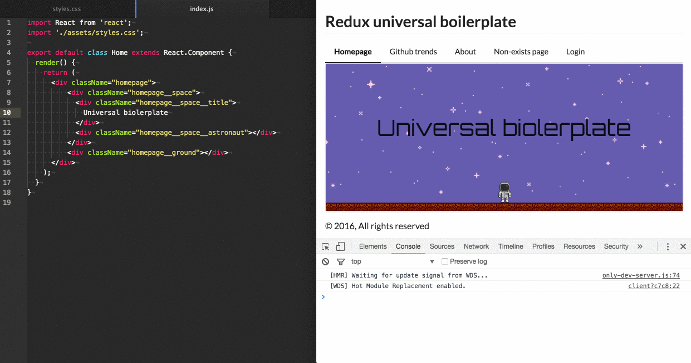

Redux universal boilerplate
===========================

Boilerplate for react universal application building on flux architecture based on redux implementation.

[](https://travis-ci.org/ufocoder/redux-universal-boilerplate)
[](https://david-dm.org/ufocoder/redux-universal-boilerplate)
[](https://david-dm.org/ufocoder/redux-universal-boilerplate?type=dev)
[](http://opensource.org/licenses/MIT)

Boilerplate based on:

* [ExpressJS](http://expressjs.com)
* [React](https://github.com/reactjs/)
* [React Router](https://github.com/reactjs/react-router)
* [React Helmet](https://github.com/nfl/react-helmet)
* [React Redux](https://github.com/reactjs/react-redux)
* [Redux](https://github.com/reactjs/redux)
* [Redux Actions](https://github.com/acdlite/redux-actions)
* [Redux Saga](https://github.com/redux-saga/redux-saga)
* [Redial](https://github.com/markdalgleish/redial)
* [BabelJS](https://babeljs.io)
* [Webpack 2](https://webpack.github.io/)
* and etc.

# Features

* es6/es7 syntax
* Testing environment
* Server and client side rendering
* Routing on client and server sides
* Hot module replacement
* Html layout as `react` component
* Not Found page with 404 HTTP status
* Stubs of media asset modules for server bundle
* CSS preprocessors support: [SASS](http://sass-lang.com/), [Stylus](http://stylus-lang.com/)

# Installation

```bash
git clone https://github.com/ufocoder/redux-universal-boilerplate.git
cd redux-universal-boilerplate

npm install
```

# Production

To build and start project for production run in console:

```bash
npm run deploy
```

# Development

There're two ways to work with boilerplate

1) Build once and then run bundles:

```bash
npm run build
npm run start
```

2) Developing in `watch` mode:

```bash
npm run watch
```

# Watch mode

When you run in console:

```bash
npm run watch
```

Two web servers will be run:

  * web-server for backend started by `server` entry point on 8000 default port
  * webpack-dev-server with `client` bundle working on 8080 default port

For working with hot reloading mode, open your in browser http://localhost:8080/, all `non-assets` http request to will be proxy to backend endpoint



# Testing environment

* [Karma](https://karma-runner.github.io/)
* [Karma-phantomjs-launcher](https://github.com/karma-runner/karma-phantomjs-launcher)
* [Mocha](https://mochajs.org/)
* [Chai](http://chaijs.com/)
* [Sinon](http://sinonjs.org/)
* [Enzyme](https://github.com/airbnb/enzyme)
* and etc.

There is a watch mode for testing:

```bash
npm run test:watch
```

# Attention
Don't forget that there's universal (isomorphic) boilerplate so you need to consider this fact when you will develop your UI application.

Remember that you should use browser objects (like window, document and etc.) in ReactJS [componentDidMount](https://facebook.github.io/react/docs/component-specs.html#mounting-componentdidmount) Method

# Contributing

I would be thankful for your [issues](https://github.com/ufocoder/redux-universal-boilerplate/issues) and [pull requests](https://github.com/ufocoder/redux-universal-boilerplate/pulls)

# License

MIT license. Copyright © 2016, Ufocoder. All rights reserved.
